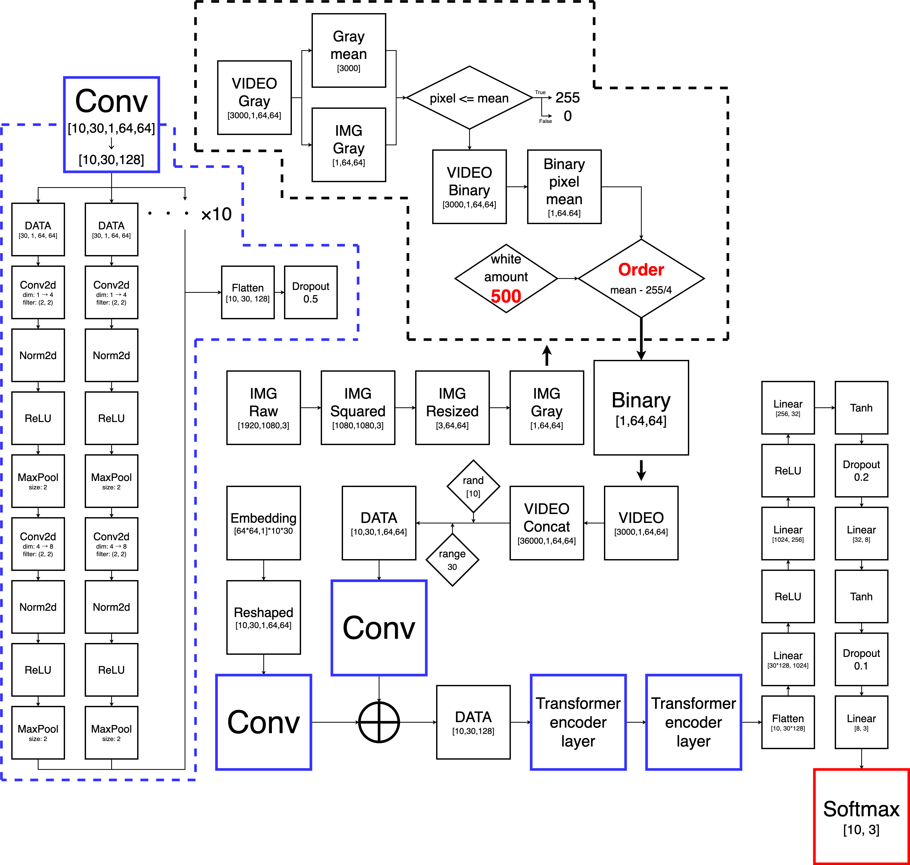

## What is predict_dance ?
***predict_dance*** is enable to decide which videoes belong to ***[elegant, dance, other]***.
## How do I start ?
first of all, you need to install **dependencies**.<br>
you should type this command.
```
pip install -r src/git/requirements.txt
```
next, you need to create directories.<br>
plz check tree down below.
<pre>
.
├── __pycache__
│   ├── *.pyc
├── archive
│   ├── *.mp4 (for stock)
├── out
│   ├── img (result's graph store automatically in this directory)
│   │   ├── epoch_1
│   │   │   ├── estimate_1.png
│   │   │   ├── ... (you can create png desirable cycle)
│   │   ├── epoch_n (you should create n files same as epoch num)
│   │   │   ├── ...
│   │   └── test (this files exist to store graph that is result each of test)
│   │       ├── estimate_1.png
│   │       ├── ...
│   ├── model (models store automatically in this directory)
│   │   ├── ...
│   └── src (video deta store automatically in this directory)
│       ├── ...
├── test
│   ├── *.mp4 (for test)
└── video
    ├── *.mp4 (for prediction)
</pre>
Finally, you checkout branches.<br>
if you type these command, you can execute prediction.
```
python main.py
```
```
python test.py
```

you can modify code everything. plz read my code and improve better!<br>
I show you recent nn for help.
## flow chart
